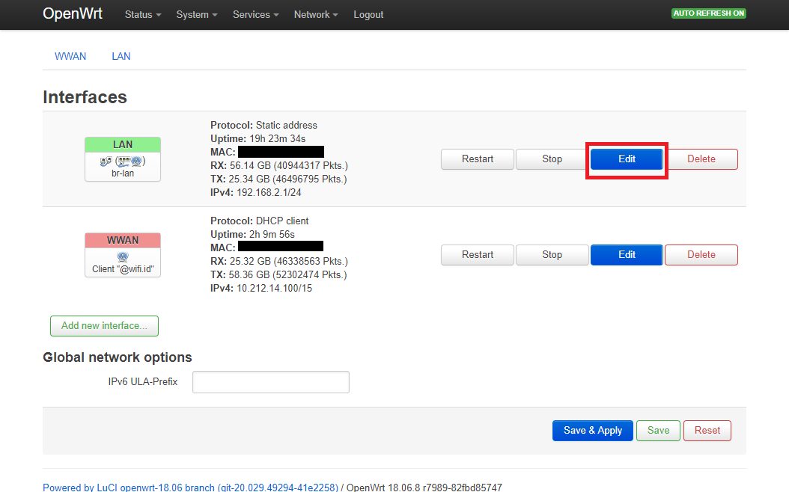
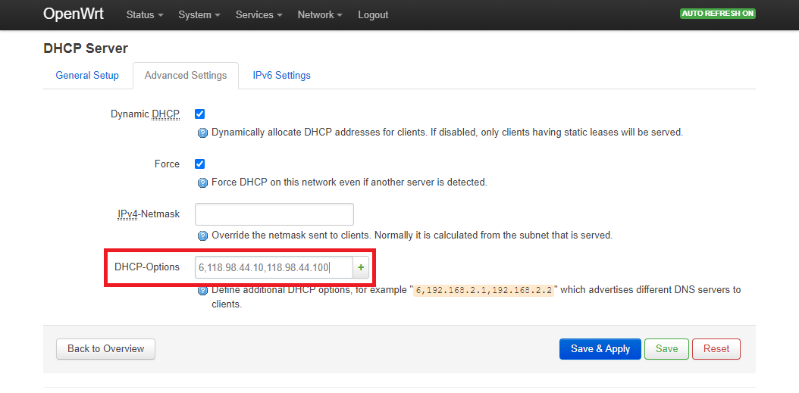
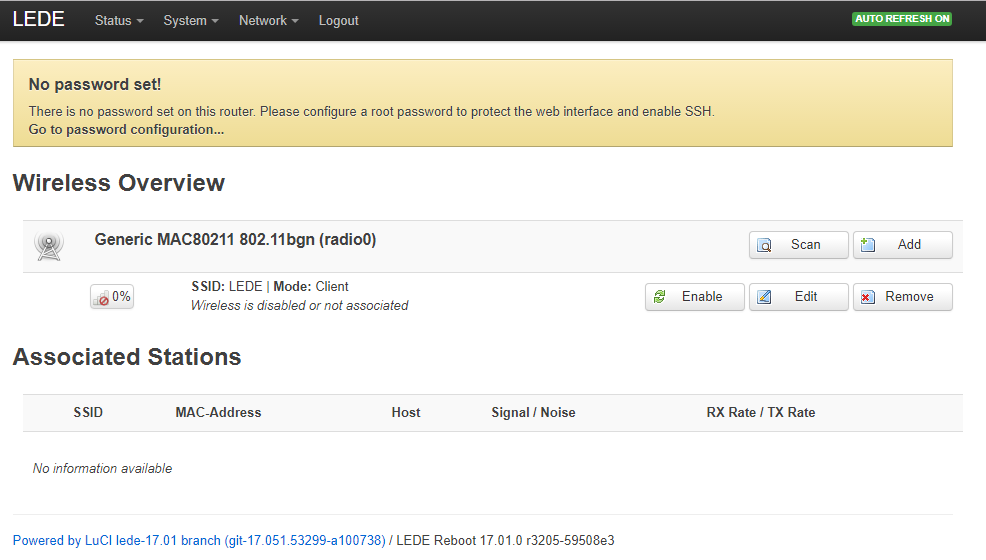
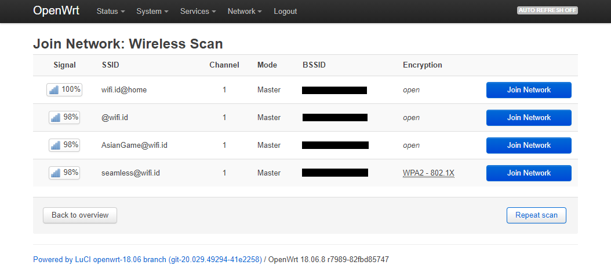
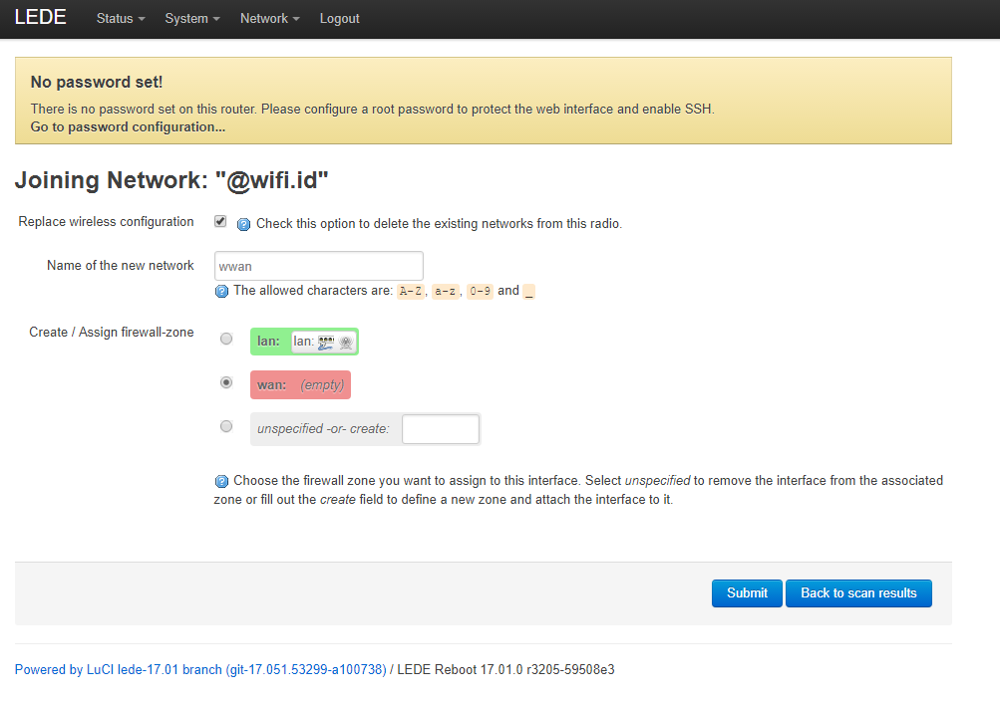
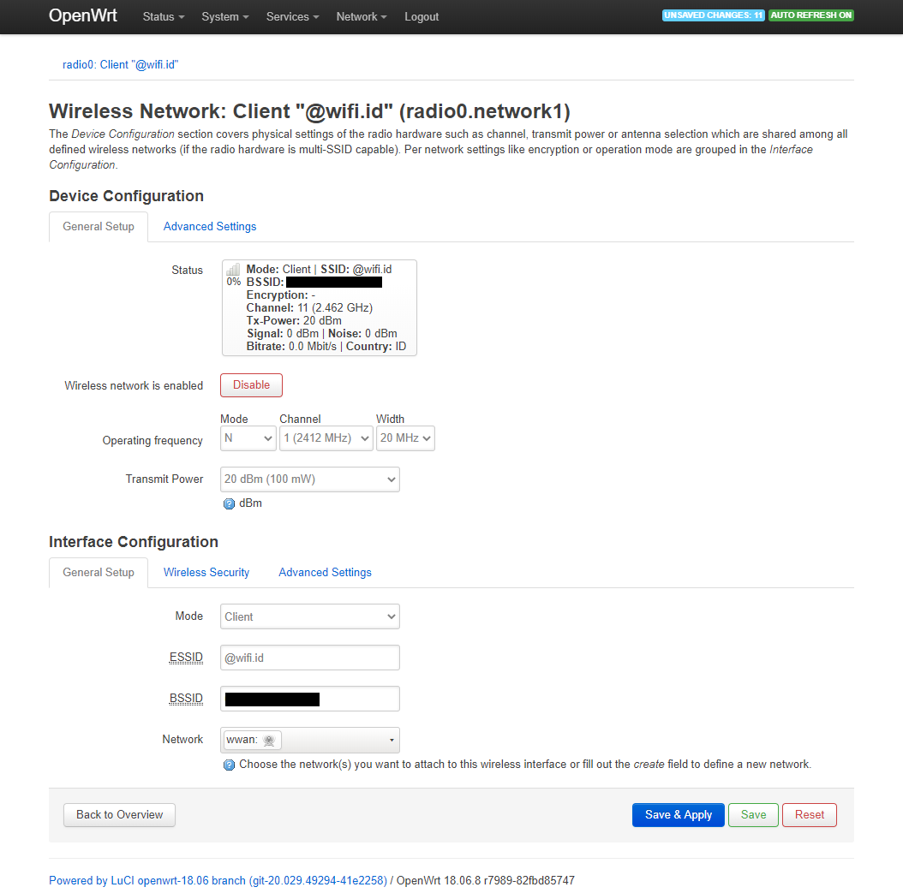
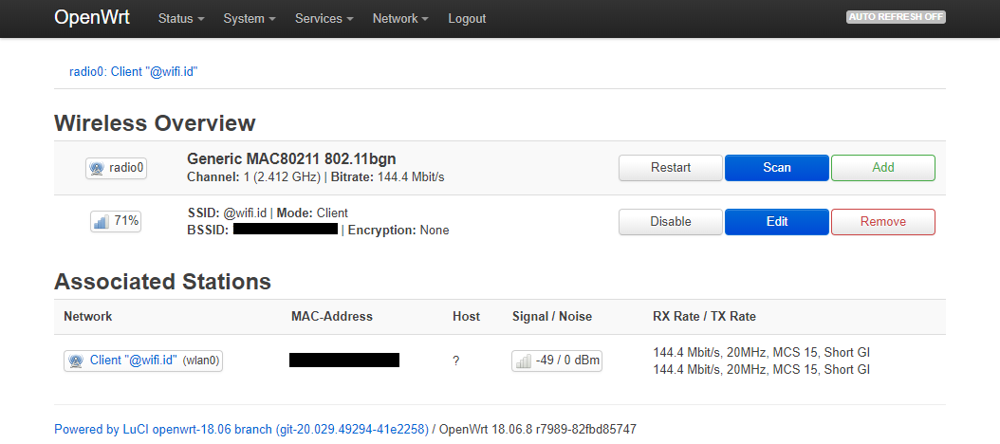
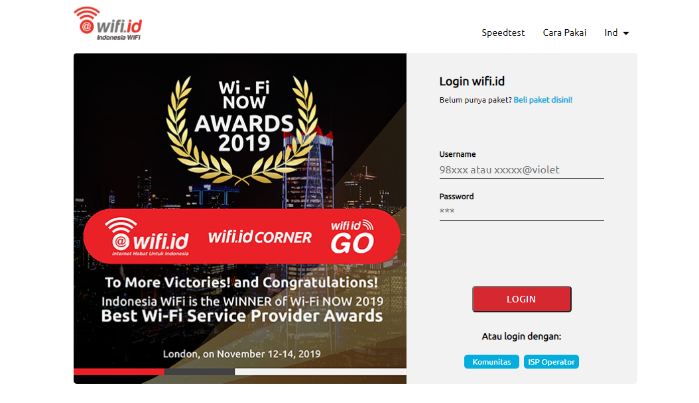
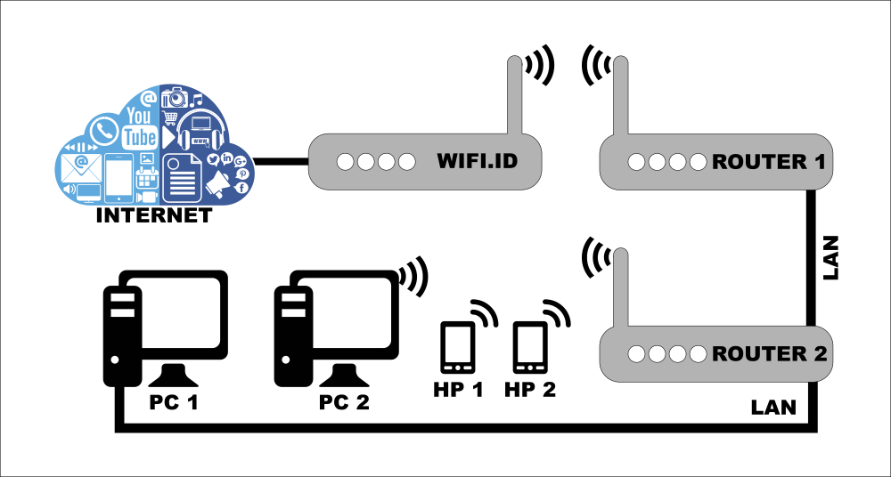

    

### **Tutorial Untuk Menangkap dan Memancarkan Kembali Sinyal @wifi.id Menggunakan OpenWrt/LEDE**

Di sini saya akan membeberkan cara menangkap dan memancarkan kembali sinyal @wifi.id untuk dipakai bersama-sama (misalnya saya untuk berlangganan internet di rumah).

### **Persyaratan:**

1. Terjangkau jaringan @wifi.id (nama wifi/SSID: @wifi.id, indischool@wifi.id, wifi.id@home, dan seamless@wifi.id). Untuk mengecek ketersediaan pemancar @wifi.id di daerah sekitar, bisa mengecek di fitur "Hotspot Finder" yang tersedia di aplikasi wifi.id GO ([android](https://play.google.com/store/apps/details?id=com.telkom.wifiidgo), [iOS](https://apps.apple.com/id/app/wifi-id-go/id1198078195)), atau melalui situs resmi @wifi.id: https://wifi.id/cari-wifi

> :warning: Berhubung tidak semua pemancar @wifi.id bisa digunakan, silahkan dicoba dulu untuk login menggunakan handphone atau laptop sebelum melanjutkan. Untuk memudahkan, bisa lihat ciri-ciri pemancar yang biasanya bisa dipakai di dokumen [access-points.md](access-points.md)

2. Punya router jaringan berbasiskan OpenWrt/LEDE (banyak terjual yang sudah terpasang OpenWrt di marketplace online ([Tokopedia](https://www.tokopedia.com/search?st=product&q=openwrt), [BukaLapak](https://www.bukalapak.com/products?search%5Bkeywords%5D=openwrt), [Shopee](https://shopee.co.id/search?keyword=openwrt)), daftar perangkat selengkapnya bisa lihat [di sini](http://wiki.openwrt.org/toh/start)), karena proses pemasangan firmware OpenWrt berbeda antara 1 perangkat dan lainnya, jadi tidak saya bahas di sini. Jika menggunakan versi snapshot, paket tambahan yang dibutuhkan hanya **luci** (dan **wpad** jika ingin terkoneksi dengan seamless@wifi.id). Jika tidak bisa mendapatkan router berbasis OpenWrt, bisa diganti dengan lini produk [TP-Link Pharos](tplink-pharos.md).

3. Punya akun @wifi.id (beli voucher fisik, atau lewat SMS ke 98108, lewat aplikasi wifi.id GO ([android](https://play.google.com/store/apps/details?id=com.telkom.wifiidgo), [iOS](https://apps.apple.com/id/app/wifi-id-go/id1198078195)) atau lewat online marketplace seperti [Tokopedia](https://www.tokopedia.com/streaming/), keterangan lebih lanjut bisa merujuk ke: https://wifi.id/beli-paket )

### **Langkah-Langkah**
#### **A. Mengatur DNS router**
1. Koneksikan perangkat (PC/laptop) ke router (biasanya [192.168.1.1](http://192.168.1.1))

   

2. Masuk ke tab **Network** -> **Interfaces**

3. Tekan tombol **Edit** di bagian **LAN**

   

4. Scroll ke bagian **DHCP Server** di bawah, lalu tekan tab **Advanced Settings*

5. Masukkan `6,118.98.44.10,118.98.44.100` di bagian **DHCP-Options**

   

6. Tekan tombol **Save and Apply**

7. Cabut-pasang kembali kabel LAN agar pengaturan ini langsung dipakai oleh perangkat

#### **B Koneksi dengan jaringan @wifi.id (selain seamless@wifi.id)**

1. Buka tab **Network** -> **Wifi/Wireless**

   

2. Tekan tombol **Scan**

3. Pilih jaringan @wifi.id (jangan pilih yang flashzone-seamless ataupun seamless@wifi.id, yang bisa hanya @wifi.id, indischool@wifi.id, dan wifi.id@home) dengan menekan tombol **Join Network** di sisi kanan nama jaringan.

   

4. Biarkan pengaturan bawaan dari OpenWrt/LEDE, langsung tekan **Submit**

   

5. Anda akan dibawa ke pengaturan wifi, tidak perlu ganti apapun, langsung tekan **Save and Apply**

   

6. Anda akan dibawa kembali ke halaman awal, status koneksi harusnya sudah berwarna biru yang menandakan berhasil terkoneksi ke jaringan

   

7. Halaman login akan muncul, lakukan login sesuai dengan voucher yang sudah dibeli

   

#### **C. Memancarkan kembali sinyal @wifi.id**

Untuk memancarkan kembali sinyal @wifi.id, saya menyarankan untuk menggunakan perangkat/router kedua, agar bandwidth tidak terpotong 50% dan lebih stabil dalam penggunaannya, seperti gambar berikut:

   

Jika ada keterbatasan dana yang menghalangi penggunaan 2 perangkat router (1 untuk menangkap dan 1 untuk menyebarkan kembali), sebenarnya anda bisa saja menggunakan 1 perangkat untuk kedua tugas tersebut, hanya saja kecepatan jaringan akan berkurang sebesar 50%. Langkah-langkahnya bisa dibaca di dokumen [repeater-mode.md](repeater-mode.md)

### seamless@wifi.id

Kelebihan sinyal seamless@wifi.id ketimbang sinyal @wifi.id lainnya adalah tidak perlu login ulang dalam selang waktu tertentu atau jika tidak dipakai dalam waktu tertentu.

Karena adanya tambahan langkah-langkah agar terkoneksi ke sinyal seamless@wifi.id, maka saya pisahkan ke dokumen [seamless.md](seamless.md)

### Login Otomatis di jaringan @wifi.id

Jika tidak tersedia jaringan seamless@wifi.id yang bisa dipakai di daerah anda, bisa merujuk dokumen [autologin.md](autologin.md) untuk cara agar tidak capek berulang-ulang login ke jaringan.