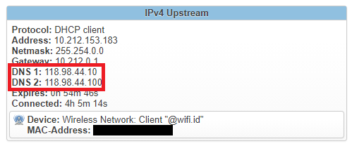
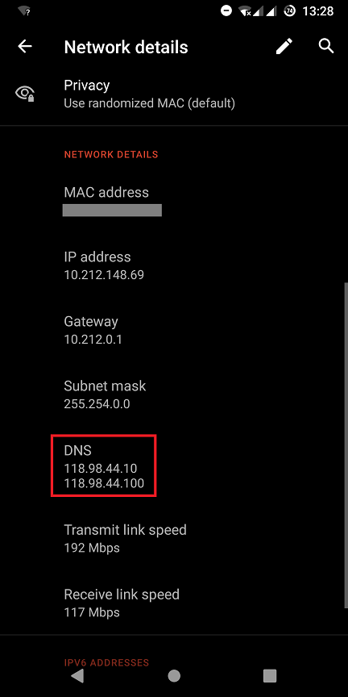
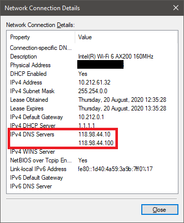
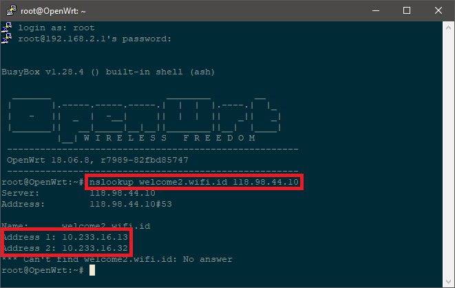
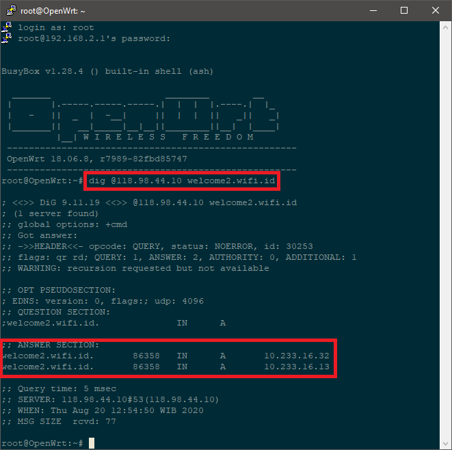

### **Pertanyaan yang sering diajukan dan Dokumen Teknis**

> :loudspeaker: Punya pertanyaan lain? Silahkan buat akun github dan bertanya di [tab Issues](https://github.com/kopijahe/wifiid-openwrt/issues) dengan menekan tombol hijau `New Issue`.

### **DNS Jaringan @wifi.id**

:question: _DNS `118.98.44.10` dan `118.98.44.100` dapatnya dari mana? Karena di daerah saya, DNS tersebut tidak bisa dipakai..._

:bulb: Bisa dilihat dari sewaktu survey menggunakan handphone/laptop, ataupun dari informasi yang diberikan oleh openwrt, bisa dilihat di halaman status koneksi. Contohnya bisa dilihat di gambar-gambar berikut:

   openwrt:  
   

   android:  
   

   windows:  
   

Kalau misal di daerah anda ternyata menggunakan alamat server DNS yang berbeda, bisa disesuaikan dengan kondisi di daerah masing-masing.

<br><br>

:question:  _Bagaimana cara tahu alamat IP untuk domain-domain yang diperlukan untuk hostname autologin?_

:bulb: Bisa menggunakan perintah `nslookup <nama domain> <server DNS>`, baik di openwrt ataupun di perangkat lainnya yang terhubung ke jaringan, dan dikonfirmasi setelah dicoba tambahkan sebagai hostname di openwrt.

   
	
Bila perintahnya tidak menghasilkan IP yang sesuai (misal tetap tidak bisa login), maka disarankan untuk memasang paket `bind-dig` dengan perintah: `opkg update && opkg install bind-dig`. Setelah terpasang, lakukan perintah: `dig @<server DNS> <nama domain>`

   

### **Autologin**

:question: _Saya lihat di script itu ada jeda pengecekan setiap 10 detik, kenapa tidak dibikin lebih pendek, misalnya 1 detik saja? Supaya kalau terputus pas lagi main game ga nunggu lama-lama..._

:bulb: Biasanya kalau terlalu cepat dalam autologin, akan mendapat status \[Ban IP\] yang menyebabkan gagalnya autologin dan juga kemungkinan turunnya kecepatan internet.

<br><br>

:question: _Saya lihat di script, untuk periksa koneksinya ke domain `periksakoneksi.kopijahe.my.id`, apa aman? Kenapa tidak mengecek ke tempat lain saja?_

:bulb: Aman-aman saja, karena tujuannya hanya mengunduh berkas [cek](https://github.com/kopijahe/periksakoneksi.kopijahe.my.id/blob/master/cek) lalu melihat apakah isinya benar "OK". Saya tidak mendapatkan/mengambil data apapun dari perangkat anda.

Soal kenapa kok tidak mengecek ke tempat lain, karena untuk itu butuh paket tambahan (`wget`) yang ukurannya lumayan besar, jadi bisa memberatkan ke pengguna script dengan perangkat yang punya penyimpanan terbatas (misal router dengan ROM 4MB).

Jika masih ragu, bisa menggunakan script alternatif:

> 1. [autologin-firefox.sh](autologin-firefox.sh), script ini menggunakan sistem yang sama dengan script [autologin.sh](autologin.sh), hanya saja domainnya milik mozilla/firefox.
> 2. [autologin-google.sh](autologin-google.sh), script ini mengecek ke domain yang sama dengan yang digunakan perangkat android untuk mengecek status koneksi internet. Syaratnya harus memasang paket ```wget``` dengan perintah ```opkg update && opkg install wget``` supaya tidak ada masalah.

<br><br>

:question: _Bisakah autologin dipakai untuk 2 koneksi berbeda? Router saya bisa 2 frekuensi (2,4 GHz dan 5,8 Ghz), rencananya saya pakai 2 akun dan di loadbalance (misal pakai mwan di openwrt)..._

:bulb: Bisa saja:

 > 1. Buat berkas autologin kedua dengan perintah ```cp /etc/autologin.sh /etc/autologin2.sh```
 > 2. Buka berkas autologin2.sh dengan perintah ```vi /etc/autologin2.sh```
 > 3. Tekan huruf ```i``` untuk memulai edit berkas autologin2.sh
 > 4. Ganti isi variabel loginwifi dengan nama berkas lain, misalnya menjadi ```loginwifi=/etc/login_file2.txt```
 > 5. Matikan dulu koneksi pertama, lalu lakukan login di koneksi kedua dan taruh hasil curl-nya di file login_file2.txt (dokumen [autologin.md](autologin.md), langkah no. 9-14)
 > 6. Edit berkas login_file.txt dengan perintah ```vi /etc/file_login.txt```, tambahkan parameter ```--interface <nama interface>``` setelah teks curl, misalnya jadi ```curl --interface wlan0 -H ....```, lalu simpan berkas
 > 7. Edit berkas login_file2.txt dengan perintah ```vi /etc/file_login2.txt```, tambahkan parameter ```--interface <nama interface>``` setelah teks curl, misalnya jadi ```curl --interface wlan1 -H ....```, lalu simpan berkas
 > 8. Tambahkan berkas autologin kedua di berkas ```/etc/rc.local```

<br><br>

:question: _Misal saya pakai kombinasi TP-Link Pharos untuk menangkap sinyal <span></span>@wifi.id + router openwrt untuk memancarkan sinyal kembali, bisakah pakai autologin di router openwrt?_

:bulb: Bisa saja. Jika nanti semisal gagal autologin, coba ditambahkan parameter ```-interface <nama interface port WAN>``` setelah perintah ```curl``` di berkas ```/etc/login_file.txt```, misalnya jadi ```curl --interface eth0.1 -H ....```

### **Lain-lain**

:question: _Bisa di-remote saja lewat teamviewer?_

:bulb: Untuk sementara belum bisa, silahkan diikuti kembali tutorialnya dengan detail. Bila perlu, lakukan factory reset kembali agar pengaturannya tidak tumpang-tindih.

<br><br>

:question: _Donasi?_

:bulb: 